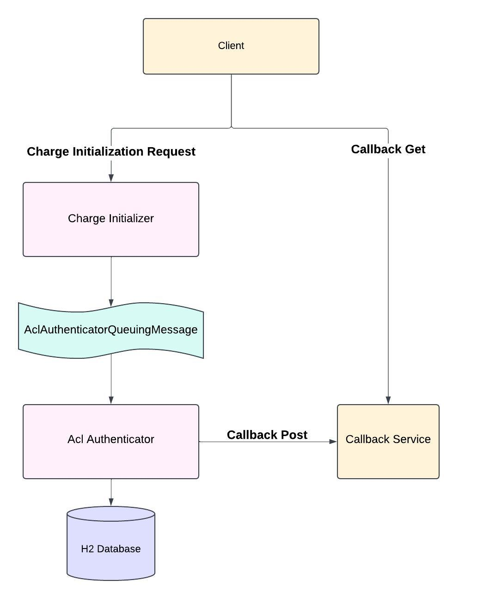

# Readme
Please follow along this guide to gain context on & test the applications present in this repository.
## Project Summary
This project contains 2 services responsible for processing a charge initialization request, i.e.
1. ChargeInitializer - Exposes a REST resource to process a charge initialization request. It validates the input & forwards the request to the authenticator service to be handled asynchronously.
2. AclAuthenticator - Handles async requests by authenticating a charge session request & passing on the response to the provided callback.

### Tech stack used:
The applications have been built using the following stack:
1. Java as the programming language
2. SpringBoot framework for executing the services
3. Kafka for async communication
4. H2 DataBase for storage layer

### Design Details:



Requests are handled in the following manner:
1. The client calls the `/chargeInitialize/start` POST endpoint to submit a request for charge session initialization.
2. This endpoint is hosted in the `ChargeInitializer` service, which handles the request by validating the input parameters, and on successful validation, produces a `AclAuthenticatorQueuingMessage` (AAQM) event to trigger the ACL authentication process in an async fashion.
3. The AAQM event is then consumed & processed by `AclAuthenticator` service further, which first fetches the ACLs for both the station & driver entities from the `CHARGE_SESSION_ACL` table to compute the final ACL permission.
4. This computed permission is then sent to the callback URL provided by the client.
5. The computed permission, along with the response from the callback URL & the input details are stored in another table called `ACL_RESPONSE_AUDIT` to record the request details for auditability purpose.

## Testing 

### Setting up Kafka:
Follow the below steps to perform one time setup of Kafka before booting the service:
1. Install kafka version kafka_2.13-3.8.1 from https://kafka.apache.org/downloads (source download option)
2. Navigate to the directory where kafka is installed & start Zookeeper 
- `bin/zookeeper-server-start.sh config/zookeeper.properties`
3. Navigate to the directory where kafka is installed & start Kafka
- `bin/kafka-server-start.sh config/server.properties`
4. Once Kafka is up, create topic AclAuthenticatorQueuingMessage. This is required to be done only once.
- `bin/kafka-topics.sh --create --bootstrap-server localhost:9092 --replication-factor 1 --partitions 1 --topic AclAuthenticatorQueuingMessage`
5. If required, you can check produced messages using the following command in the directory where kafka is installed. The following is the command to consume messages produced on our topic.
- `./bin/kafka-console-consumer.sh --bootstrap-server localhost:9092 --topic AclAuthenticatorQueuingMessage`

### Running the applications:
Follow the below commands for both services to boot up the applications :
1. Run commands from the previous section's step 2, followed by step 3 for getting Kafka up.
2. Run `./gradlew build` to build application
3. Run `./gradlew bootRun` to run service locally
   - The ChargeInitializer application will be hosted at `localhost:8080`
   - The AclAuthenticator application will be hosted at `localhost:8081`

### Testing the application:
Once the applications are up, we can test them out by simply hitting  POST for initializing charge request. This can be done through a tool like Postman or hitting the following curl commands from terminal.


**Case 1) Happy case:**
Station ID & driver ID both are valid & have ALLOWED ACLs

Request to /chargeInitialize:
```
curl -H 'Content-Type: application/json' \
-d '{
"stationId":"123e4567-e89b-12d3-a456-426614174000",
"driverId":"maitreyi_sondhi_12345",
"callbackUrl":"http://localhost:8081/dummyCallback/post"
}' \
-X POST \
http://localhost:8080/chargeInitialize/start
```
Response from /chargeInitialize:
```json
{
    "status": "accepted",
    "message": "Request is being processed asynchronously. The result will be sent to the provided callback URL."
}
```

Logs from `AclAuthenticator` service for handling request:
```
2025-04-05T11:49:49.989+05:30  INFO 92548 --- [AclAuthenticator] [ntainer#0-0-C-1] h.AclAuthenticatorQueuingMessageConsumer : Received AAQM Event: {stationId='123e4567-e89b-12d3-a456-426614174000', driverId='maitreyi_sondhi_12345', callbackUrl='http://localhost:8081/dummyCallback/post', timestamp=1743833989983}
2025-04-05T11:49:49.994+05:30  INFO 92548 --- [AclAuthenticator] [ntainer#0-0-C-1] c.c.h.AuthenticationRequestHandler       : Permission Status computed for the request: ALLOWED
2025-04-05T11:49:49.998+05:30  INFO 92548 --- [AclAuthenticator] [nio-8081-exec-4] c.c.controller.DummyCallbackController   : Received request on dummy callback URL CallbackRequest{stationId='123e4567-e89b-12d3-a456-426614174000', driverToken='maitreyi_sondhi_12345', status=ALLOWED}
2025-04-05T11:49:49.999+05:30  INFO 92548 --- [AclAuthenticator] [ntainer#0-0-C-1] c.c.h.AuthenticationRequestHandler       : Audit created for this request: AclResponseAudit{stationId='123e4567-e89b-12d3-a456-426614174000', driverId='maitreyi_sondhi_12345', callbackUrl='http://localhost:8081/dummyCallback/post', timestamp=1743833989983, permissionStatus=ALLOWED, callbackResponseStatus=201}
```


**Case 2) Testing for negative case:**
Station ID & driver ID both are valid but driver ID does not have ALLOWED ACL.

Request to /chargeInitialize:
```
curl -H 'Content-Type: application/json' \
-d '{
"stationId":"123e4567-e89b-12d3-a456-426614174000",
"driverId":"someone_else_1234567890",
"callbackUrl":"http://localhost:8081/dummyCallback/post"
}' \
-X POST \
http://localhost:8080/chargeInitialize/start
```
Response from /chargeInitialize:
```json
{
    "status": "accepted",
    "message": "Request is being processed asynchronously. The result will be sent to the provided callback URL."
}
```

Logs from `AclAuthenticator` service for handling request:
```
2025-04-05T11:58:03.938+05:30  INFO 92548 --- [AclAuthenticator] [ntainer#0-0-C-1] h.AclAuthenticatorQueuingMessageConsumer : Received AAQM Event: {stationId='123e4567-e89b-12d3-a456-426614174000', driverId='someone_else_1234567890', callbackUrl='http://localhost:8081/dummyCallback/post', timestamp=1743834483910}
2025-04-05T11:58:03.943+05:30  INFO 92548 --- [AclAuthenticator] [ntainer#0-0-C-1] c.c.h.AuthenticationRequestHandler       : Permission Status computed for the request: NOT_ALLOWED
2025-04-05T11:58:03.959+05:30  INFO 92548 --- [AclAuthenticator] [nio-8081-exec-6] c.c.controller.DummyCallbackController   : Received request on dummy callback URL CallbackRequest{stationId='123e4567-e89b-12d3-a456-426614174000', driverToken='someone_else_1234567890', status=NOT_ALLOWED}
2025-04-05T11:58:03.963+05:30  INFO 92548 --- [AclAuthenticator] [ntainer#0-0-C-1] c.c.h.AuthenticationRequestHandler       : Audit created for this request: AclResponseAudit{stationId='123e4567-e89b-12d3-a456-426614174000', driverId='someone_else_1234567890', callbackUrl='http://localhost:8081/dummyCallback/post', timestamp=1743834483910, permissionStatus=NOT_ALLOWED, callbackResponseStatus=201}

```

**Case 3) Testing for invalid input:**
Station ID passed is not valid.

Request to /chargeInitialize:
```
curl -H 'Content-Type: application/json' \
-d '{
"stationId":"12345",
"driverId":"maitreyi_sondhi_12345",
"callbackUrl":"http://localhost:8081/dummyCallback/post"
}' \
-X POST \
http://localhost:8080/chargeInitialize/start
```
Response from /chargeInitialize:
```json
{
    "status": "bad_request",
    "message": "Station ID passed is invalid, please retry with a valid UUID for Station ID."
}
```

No Logs since input validation failed & request is not processed further.


**Case 4) Testing for missing input data:**
Station ID & driver ID both are valid & but driver ID does not have any ACL information in DB.

Request to /chargeInitialize:
```
curl -H 'Content-Type: application/json' \
-d '{
"stationId":"123e4567-e89b-12d3-a456-426614174000",
"driverId":"someone_missing_from_DB_1234567890",
"callbackUrl":"http://localhost:8081/dummyCallback/post"
}' \
-X POST \
http://localhost:8080/chargeInitialize/start
```
Response from /chargeInitialize:
```json
{
    "status": "accepted",
    "message": "Request is being processed asynchronously. The result will be sent to the provided callback URL."
}
```

Logs from `AclAuthenticator` service for handling request:
```
2025-04-05T12:06:39.673+05:30  INFO 94600 --- [AclAuthenticator] [ntainer#0-0-C-1] h.AclAuthenticatorQueuingMessageConsumer : Received AAQM Event: {stationId='123e4567-e89b-12d3-a456-426614174000', driverId='someone_missing_from_DB_1234567890', callbackUrl='http://localhost:8081/dummyCallback/post', timestamp=1743834999648}
2025-04-05T12:06:39.686+05:30  INFO 94600 --- [AclAuthenticator] [ntainer#0-0-C-1] c.c.h.AuthenticationRequestHandler       : Permission Status computed for the request: INVALID
2025-04-05T12:06:39.752+05:30  INFO 94600 --- [AclAuthenticator] [nio-8081-exec-1] o.a.c.c.C.[Tomcat].[localhost].[/]       : Initializing Spring DispatcherServlet 'dispatcherServlet'
2025-04-05T12:06:39.753+05:30  INFO 94600 --- [AclAuthenticator] [nio-8081-exec-1] o.s.web.servlet.DispatcherServlet        : Initializing Servlet 'dispatcherServlet'
2025-04-05T12:06:39.755+05:30  INFO 94600 --- [AclAuthenticator] [nio-8081-exec-1] o.s.web.servlet.DispatcherServlet        : Completed initialization in 2 ms
2025-04-05T12:06:39.783+05:30  INFO 94600 --- [AclAuthenticator] [nio-8081-exec-1] c.c.controller.DummyCallbackController   : Received request on dummy callback URL CallbackRequest{stationId='123e4567-e89b-12d3-a456-426614174000', driverToken='someone_missing_from_DB_1234567890', status=INVALID}
2025-04-05T12:06:39.800+05:30  INFO 94600 --- [AclAuthenticator] [ntainer#0-0-C-1] c.c.h.AuthenticationRequestHandler       : Audit created for this request: AclResponseAudit{stationId='123e4567-e89b-12d3-a456-426614174000', driverId='someone_missing_from_DB_1234567890', callbackUrl='http://localhost:8081/dummyCallback/post', timestamp=1743834999648, permissionStatus=INVALID, callbackResponseStatus=201}

```


### Querying the DataBase:
No separate setup needs to be perfomed for DataBase, follow the below steps to view table data:
1. Once the service AclAuthenticator is up, you can open the following link on Chrome - 
`http://localhost:8081/h2-console`
2. Log in with the following credentials:
   - Driver Class: org.h2.Driver
   - JDBC URL: jdbc:h2:mem:aclDB
   - User Name: sa
   - Password : _Keep this Empty_
3. Run the following at any time to view the state of the DB

```
SELECT * FROM ACL_RESPONSE_AUDIT;
SELECT * FROM CHARGE_SESSION_ACL;
```
4. Any change to the DataBase can be made from the console provided in the above URL.


## Other details:

### Table schema
Schema for the 2 tables defined above are as follows:

Schema for CHARGE_SESSION_ACL : Stores ACLs for each entity. This entity could either be the driver, or the station.

```sql
CREATE TABLE CHARGE_SESSION_ACL
(
   ENTITY_ID   VARCHAR(100) PRIMARY KEY,
   ENTITY_TYPE ENUM ('DRIVER', 'STATION'),
   ACCESS      ENUM ('ALLOWED', 'DENIED')
);
```

Schema for ACL_RESPONSE_AUDIT : Stores each request's input & output data, persisted for tracking
```sql
CREATE TABLE ACL_RESPONSE_AUDIT
(
   ID                       BIGINT PRIMARY KEY AUTO_INCREMENT,
   STATION_ID               VARCHAR(100),
   DRIVER_ID                VARCHAR(100),
   CALLBACK_URL             VARCHAR(100),
   TIMESTAMP                BIGINT,
   PERMISSION_STATUS        ENUM ('ALLOWED', 'NOT_ALLOWED', 'UNKNOWN', 'INVALID'),
   CALLBACK_RESPONSE_STATUS INT
);
```

### Scaling considerations
To make these applications scalable the following enhancements can be made:
1. Currently our applications are hosted locally on our system. We can autoscale the applications by deploying them online on Kubernetes containers.
2. Currently we are using H2 for storing our data locally due to ease of set up. For productionization, we can use MySQL servers instead of H2 for a more scalable relation database.
3. Replace the current mock ACL data with a mechanism to ingest new ACL permissions through a new REST endpoint.
4. In the current setup, the callback URL handling is mocked as a REST endpoint `/dummyCallback` within the `AclAuthenticator` application. It can be replaced with another Callback Service for handling GET & POST callback requests.
5. Unit Tests can be added to do testing of each component in an isolated fashion.
6. An ETL pipeline can also be set up to perform auditing & data analysis on the tracking data. Currently this tracking data is ingested in the `ACL_RESPONSE_AUDIT` table.
